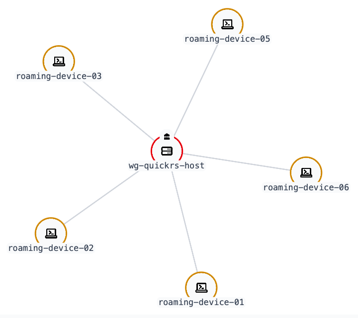
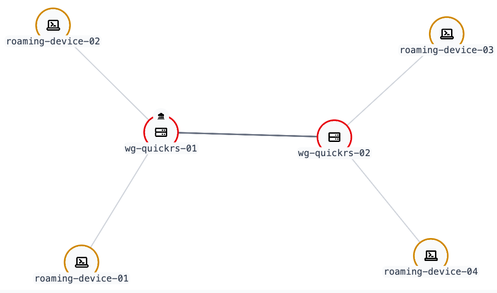
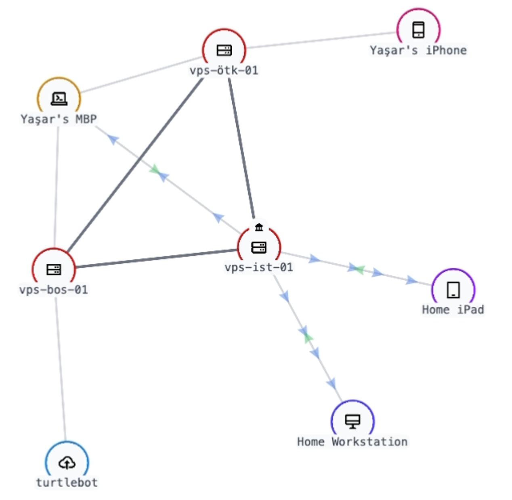

# Network Setup

`wg-quickrs` is essentially a wrapper around `wg` that exposes all the configurable options via the terminal or the web console.

Because `wg-quickrs` is so configurable, you can create almost any network topology you want.
You need to watch out for the AllowedIPs and the firewall rules (which can also be configured via the web console).

## Road Warrior

In `wg-quickrs` agent initialization on a host with public IP address, default options to the prompts should set up a road warrior configuration.

When you add a new roaming peer (without a static endpoint), AllowedIPs of the new peer will be defaulted to 0.0.0.0/0, allowing all traffic to the `wg-quickrs` agent.

  

## Site-to-Site

If you set up AllowedIPs and firewall rules correctly, you can create a site-to-site configuration.

  

## Mesh

If you set up AllowedIPs and firewall rules correctly, you can also create a mesh network.

⚠️ Note: Peers without static endpoints (roaming peers) cannot discover other roaming peers.
So even if you can connect them on the web console, they will not be able to discover each other and you will not get a handshake.

  

