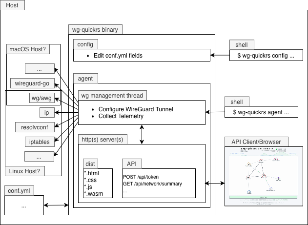

# wg-quickrs diagram

`wg-quickrs` is a Rust-based alternative for `wg-quick` that executes the same underlying commands, 
ensuring identical tunnel setup behavior.
It has a lot going on, but it doesn't do everything on its own --it depends on some external tools.

Following is a diagram of the architecture.

  

